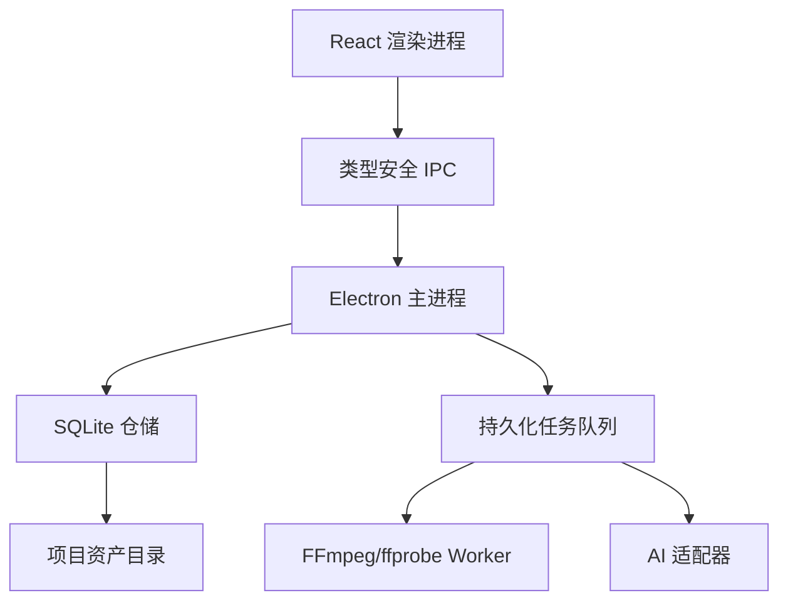

# CineWeave Studio（影织）产品与技术规格说明书

> 版本：1.0
> 日期：2026-07-09
> 目标：参考 Lapian Notes 的核心闭环，设计一款功能完整、可持续演进、界面专业美观的本地优先影视拆解产品。

## 0. 结论与推荐

推荐从一款桌面端单机产品起步，产品定位为“影视拆解与创作学习工作台”。首个可发布版本应同时完成五条主链路：媒体导入与预处理、镜头与字幕时间轴、AI 分析与人工校订、多视图叙事分析、项目保存与专业导出。

技术路线采用 Electron + React + TypeScript + SQLite + FFmpeg：

- Electron 负责稳定访问本地文件、启动 FFmpeg、打包 Windows/macOS 应用。
- React + TypeScript 负责高交互密度的时间线与编辑器。
- SQLite 保存结构化项目数据；媒体与缩略图使用项目目录中的文件资产。
- FFmpeg/ffprobe 负责探测、转码、抽帧、波形、字幕提取和镜头边界候选。
- AI 采用双通路：手动分析包往返始终可用；用户可选 BYOK 直连模型。

不建议第一版加入多人实时协作、云端媒体托管和移动端编辑。这三项会显著扩大账号、同步、权限、存储、合规与运维范围。第一版预留导入导出边界，后续再加入云同步。

---

## 1. 对参考项目的核查结论

### 1.1 项目事实快照

Lapian Notes 是一个 MIT 许可、中文界面、本地运行的 React 19 + TypeScript + Vite 8 项目。它于 2026-07-08 首次发布 v0.1.0；截至本报告核查时，仓库没有公开 Issue 或 PR，提交记录显示作者在首发后密集修正新手启动、项目切换、无字幕流程、字幕错配和 AI 导入等问题。

已确认的核心功能：

1. 导入影片，按固定间隔抽帧并生成全片时间轴。
2. 读取内嵌字幕、手动字幕，或通过本地 Vite 中间件搜索网络字幕。
3. 将帧图、字幕、剧情资料和提示词封装成 ZIP，交给任意 AI。
4. 导回 JSON，生成剧情泳道、结构树、观众情绪曲线。
5. 段落级深拆，编辑段落功能、关键节拍、剧本还原、创作意图等字段。
6. IndexedDB 项目库、localStorage 自动保存、帧图缓存、自包含 ZIP 备份。
7. Markdown 与剧本正文导出。
8. Windows 与 macOS 一键启动脚本。

### 1.2 当前实现架构

| 层 | 当前实现 | 核查依据 |
|---|---|---|
| UI | React 19、单页三栏工作区、中文 CSS 设计 | `package.json`、`App.css` |
| 应用协调 | `App.tsx` 约 1336 行 | 当前源文件统计 |
| 时间线 | `FrameTimeline.tsx` 约 1039 行 | 当前源文件统计 |
| 检查器 | `InspectorPanel.tsx` 约 633 行 | 当前源文件统计 |
| AI 数据导入 | JSON 解析、影片名匹配、预览、三种写入模式 | `src/lib/aiImport.ts` |
| 媒体处理 | 浏览器抽帧；Vite dev server 调 FFmpeg 转码 | `videoFrames.ts`、`transcode-server-plugin.ts` |
| 字幕 | 内嵌/手动/网络搜索；按片长拒绝明显错配 | `subtitle-server-plugin.ts` 与提交记录 |
| 存储 | localStorage + IndexedDB；ZIP 迁移 | `autosave.ts`、`frameStore.ts`、`projectStore.ts` |
| 导出 | Markdown、剧本、项目包、AI 包 | `markdown.ts`、`framePackage.ts` |

### 1.3 最值得借鉴的设计

#### A. 闭环清晰

“导入影片 → 生成分析包 → AI 返回结构 → 人工精修 → 导出”是一条完整价值链。用户在每个阶段都能获得可见产物，降低了 AI 黑盒感。

#### B. 本地优先

影片不上传，既降低成本，也符合创作者对未发布素材的隐私预期。对长视频而言，本地抽帧和转码还避免了高昂上传时间。

#### C. AI 服务解耦

手动 ZIP/JSON 往返允许用户使用任意模型，无需产品方承担推理费用或 API 密钥托管。这个模式应作为长期保底通路保留。

#### D. 结构化结果可人工修订

AI 输出最终落入可编辑的段落、故事线、结构与情绪点。用户可以验证、覆盖、追加，符合专业工具“机器提案、人类定稿”的工作方式。

#### E. 提交记录体现真实用户驱动

作者修复了无字幕死路、错字幕污染、切片后找不到旧项目、跨电脑片名不一致等问题。这些变化比功能列表更能揭示真实产品风险。

### 1.4 当前缺口与风险

| 优先级 | 缺口或风险 | 影响 | 推荐处理 |
|---|---|---|---|
| P0 | README 写 Node.js 18+，Vite 8 官方要求 Node.js 20.19+ 或 22.12+ | 一键启动可能安装错误运行时 | 固定并检测兼容 Node 版本；桌面安装包内置运行环境 |
| P0 | 核心编排文件与时间线组件过大 | 改动易引发回归，Claude Code 也容易误伤 | 按领域拆分状态、服务、视图与命令，不做过度抽象 |
| P0 | `package.json` 没有测试脚本 | AI 导入、时间边界、项目迁移缺乏回归防线 | 建立 Vitest、Playwright、固定媒体夹具和 JSON 契约测试 |
| P0 | Vite 开发服务器承担本地后端职责 | 静态构建会功能降级，生产打包边界模糊 | 迁入 Electron main/worker 进程 |
| P0 | 转码缓存只以文件名与大小生成 ID | 同名同大小不同内容可能碰撞 | 使用绝对路径元数据与首尾分块哈希；导入后生成资产 UUID |
| P0 | 浏览器存储承担项目数据库 | 配额、清理、迁移、事务与故障恢复能力有限 | SQLite + 项目资产目录 + 原子写入 |
| P1 | 固定 1 秒抽帧无法表达镜头语法 | 快切漏帧、长镜头冗余 | 自动镜头检测 + 用户可调敏感度 + 固定间隔补采样 |
| P1 | 字幕站抓取依赖页面结构和版权状态 | 易失效，也有合规不确定性 | 首发支持内嵌、旁挂、ASR；网络字幕设为可插拔提供方 |
| P1 | AI JSON 依靠模型遵守提示词 | 结构漂移、半截 JSON、时间越界 | JSON Schema、修复器、导入预检、差异预览、事务回滚 |
| P1 | 缺少任务队列与可恢复执行 | 长转码中断后体验差 | 持久化任务状态；取消、重试、断点恢复、日志导出 |
| P1 | UI 信息量高，主要依赖单一浅色工作区 | 长时间使用疲劳，层级不够突出 | 专业暗色主界面、可折叠面板、专注模式、命令面板 |
| P2 | 缺少全文检索、版本历史、跨片对比 | 笔记积累后难形成知识资产 | SQLite FTS、检查点、对比工作台 |
| P2 | 缺少专业交换格式 | 难接入剪辑与研究流程 | CSV、PDF、FCPXML、EDL、带时间码字幕导出 |

### 1.5 可形成产品壁垒的方向

单纯“AI 总结电影”很容易被通用模型覆盖。长期壁垒来自四类资产：

1. **时间对齐数据**：镜头、场景、段落、台词、角色、情绪、叙事功能都绑定准确时间码。
2. **可校订工作流**：AI 结论有证据帧、字幕来源、置信度和人工版本。
3. **个人影视知识库**：跨片检索、结构模板、手法标签、对比分析不断积累。
4. **专业交换能力**：能把研究结果带回剪辑、剧本、教学和内容创作流程。

---

## 2. 产品定义

### 2.1 产品名与一句话

暂定名：**CineWeave Studio / 影织**。

一句话：把任意影视素材转化为可验证、可编辑、可检索、可复用的镜头级创作知识。

### 2.2 目标用户

首要用户：

- 电影、动画、短片、广告和游戏过场的导演、编剧、剪辑师。
- 影视专业学生、教师、影评与内容创作者。
- 需要建立案例库的创意团队与培训机构。

暂缓用户：大型影视制作公司的在线审片团队。其核心需求涉及权限、水印、审计、云转码和多方批注，适合后续企业版。

### 2.3 核心用户任务

1. 我想快速看清一部片的镜头、场景、段落和全片结构。
2. 我想理解某段为何有效，并找到画面、台词和节奏证据。
3. 我想修改 AI 的判断，保存自己的方法论。
4. 我想比较多部作品的同类段落，形成创作参考。
5. 我想把结果导出到论文、课程、剧本或剪辑软件。

### 2.4 产品原则

- 本地优先：默认媒体不离开设备。
- 证据优先：AI 结论必须能指回时间码、帧图或字幕。
- 人工可控：所有 AI 结果可预览、选择性合并、撤销和锁定。
- 渐进复杂度：新用户沿向导完成闭环，专业用户可展开高级面板。
- 可迁移：项目有版本化格式，支持离线备份和跨设备迁移。
- 长任务可恢复：转码、ASR、抽帧、分析均有进度、取消、重试与恢复。

---

## 3. 版本范围与优先级

### 3.1 V1.0 必须完成（P0）

#### 项目与媒体

- 新建、打开、重命名、复制、归档、删除项目。
- 导入 MP4/MOV/MKV/AVI/WEBM 等常见容器。
- ffprobe 媒体探测；不兼容编码生成代理文件。
- 原始媒体只读引用，可选择复制入项目。
- 后台任务队列、进度、取消、重试、失败日志。

#### 时间轴与字幕

- 自动镜头边界候选，支持敏感度调整、合并、拆分。
- 固定间隔补充抽帧；镜头封面可手动替换。
- 波形与音频峰值缓存。
- 内嵌字幕提取，SRT/VTT/ASS 导入，字幕编辑与时间偏移。
- 可选本地 Whisper 转写接口；V1 可先提供安装检测与适配层。
- 视频播放器与镜头、字幕、段落双向同步。

#### 结构化分析

- 层级：作品 → 幕/章节 → 段落/场景 → 镜头。
- 剧情泳道、结构树、情绪曲线、镜头网格四种主视图。
- 段落字段：功能、关键节拍、人物目标、冲突、信息控制、创作意图、节奏、视听手法、观众体验、可复用方法、笔记。
- 镜头字段：景别、角度、运动、构图、时长、色彩、声音、对白、动作、标签、笔记。
- AI 总览分析、段落深拆、镜头标签与情绪点建议。
- AI 导入预检、差异预览、填空/追加/覆盖、撤销。

#### AI 通路

- 手动 ZIP/JSON 往返。
- OpenAI-compatible、Anthropic-compatible 两类 BYOK 适配器。
- 密钥仅存系统钥匙串。
- 请求前明确展示将发送的文字与图片数量。
- JSON Schema 约束、响应修复、重试和原始结果留存。

#### 保存与导出

- SQLite 自动保存、事务、schema migration、检查点。
- 项目包导入导出，包含数据库、缩略图、配置和清单。
- Markdown、PDF、CSV、SRT/VTT、联系表图片导出。
- 自动备份与最近项目恢复。

#### UI 与可用性

- 中文与英文。
- 暗色主工作区、浅色文档预览。
- 键盘快捷键、命令面板、撤销/重做、可调面板。
- 空状态、失败状态、离线状态、长任务状态完整。

### 3.2 V1.1 建议新增（P1）

- 跨项目全文检索与标签筛选。
- 双片对比：同步播放、结构对齐、镜头节奏和情绪曲线叠加。
- 模板：电影、短剧、广告、MV、动画、游戏过场。
- 可视化统计：平均镜头长度、景别分布、人物出场、对白密度、色彩板。
- AI 证据面板：显示每个结论关联的字幕和帧图。
- FCPXML/EDL 标记导出。
- 插件式分析器接口。

### 3.3 V2 候选（P2）

- 端到端加密云同步。
- 评论、批注分派、只读分享包。
- 团队模板与术语库。
- 本地向量检索与跨片语义搜索。
- 教学模式、作业与评分量表。

---

## 4. 信息架构与主流程

### 4.1 一级导航

1. 项目库
2. 分析工作台
3. 对比工作台（V1.1）
4. 导出中心
5. 任务中心
6. 设置

### 4.2 分析工作台布局

```text
┌ 顶栏：项目 / 保存状态 / 搜索 / 任务 / 导出 / AI ┐
├ 左侧：视图导航、故事线、章节树 ┬ 中央：播放器/主视图 ┬ 右侧：检查器 ┤
└ 底部：可缩放多轨时间线（视频、镜头、字幕、段落、标记、情绪） ┘
```

中央主视图可切换：

- 镜头网格
- 剧情泳道
- 结构树
- 情绪曲线
- 剧本/字幕
- 统计面板

### 4.3 首次使用闭环

1. 用户选择影片和项目位置。
2. 系统探测媒体，必要时建议创建代理。
3. 后台生成镜头边界、缩略图、波形并提取字幕。
4. 用户检查边界，选择分析模板。
5. 用户选择手动 AI 包或 BYOK。
6. 系统展示将发送的数据清单。
7. AI 结果进入预览区；用户选择合并方式。
8. 工作台生成多视图；用户编辑并锁定关键结论。
9. 用户创建检查点，导出报告或项目包。

---

## 5. 详细功能需求与验收标准

### FR-001 项目创建

要求：创建时生成唯一项目 ID、SQLite 数据库、资产目录和 manifest。项目名可重复，路径不可冲突。

验收：

- 名称含中文、空格、括号、emoji 时可正常创建、重开和导出。
- 目标目录无写权限时给出明确错误，系统不留下半成品目录。
- 应用异常退出后，最近项目列表仍保持一致。

### FR-002 媒体探测与代理

要求：使用 ffprobe 读取时长、容器、视频/音频/字幕流、帧率、分辨率、旋转和色彩信息。

验收：

- 可变帧率、无音轨、竖屏、旋转元数据、多个音轨均能导入。
- 不支持直接播放时生成 H.264/AAC 代理，原媒体不被修改。
- 代理中断后可重试；旧临时文件可安全清理。

### FR-003 镜头检测

要求：FFmpeg 场景变化分数生成候选；用最短镜头时长抑制闪光和运动误检；允许手工合并、拆分、移动边界。

验收：

- 每个镜头满足 `start < end`，相邻镜头无重叠。
- 修改边界后，关联段落与 AI 证据引用保持可追踪。
- 重新检测需先展示差异，已锁定的人工边界不可被覆盖。

### FR-004 字幕与转写

要求：支持内嵌文本字幕、SRT/VTT/ASS、时间整体偏移和逐条编辑。

验收：

- UTF-8、UTF-16、GB18030 常见编码可读取。
- 时间越界、倒序、重叠、空文本会在导入报告中标注。
- 错误字幕不会进入 AI 包，除非用户明确确认。

### FR-005 AI 分析包

要求：包内包含 manifest、schema、指令、低分辨率证据帧、字幕切片和可选背景资料。包大小超限时按段分卷。

验收：

- 同一项目同一版本生成的包可复现。
- 包中不包含 API Key、绝对路径或未勾选的私人笔记。
- 无字幕、无音轨、只有少量帧时仍可生成，并在提示中说明证据缺失。

### FR-006 AI 结果导入

要求：依次执行 JSON 提取、Schema 校验、ID/时间映射、语义规则校验、差异预览、事务写入。

验收：

- Markdown 代码围栏、前后解释文本、尾逗号等常见模型输出可被安全提取或明确拒绝。
- 时间负数、超片长、`start >= end`、未知引用、重复 ID 不得直接落库。
- 导入失败时项目保持导入前状态。
- 覆盖操作可一次撤销；锁定字段默认不覆盖。

### FR-007 层级时间线

要求：支持幕、段落、场景、镜头、字幕、标记和情绪轨道；缩放范围从全片到单帧附近。

验收：

- 2 小时、1000 镜头项目滚动和缩放维持 50 FPS 以上的交互目标。
- 播放头、播放器、列表选择同步误差目标小于 100 ms。
- 大数据量采用虚拟化，DOM 节点不随镜头总数线性膨胀。

### FR-008 人工编辑

要求：编辑器支持自动保存、撤销/重做、字段锁定、批量标签和快捷键。

验收：

- 连续输入不会每个按键都触发重型数据库写入。
- 撤销栈覆盖新增、删除、边界移动、批量标签和 AI 合并。
- 关闭应用前有未落盘操作时阻止静默退出。

### FR-009 多视图

要求：泳道、结构树、情绪曲线与镜头网格共享同一数据源和选择状态。

验收：

- 在任一视图修改段落标题，其他视图即时更新。
- 点击任何节点可跳至准确时间码并在检查器打开同一实体。
- 没有 AI 结果时，用户也可纯手工建立全部结构。

### FR-010 版本与恢复

要求：每次 AI 合并、批量编辑、导入前自动建立轻量检查点；用户可命名检查点。

验收：

- 任意检查点可预览差异后恢复。
- schema 升级前自动备份，迁移失败可回滚。
- 断电模拟后数据库通过完整性检查，最近一次已提交事务存在。

### FR-011 导出

要求：Markdown/PDF 报告可选章节、图片密度、字段、主题与页眉页脚；CSV 面向数据分析；字幕保持时间码。

验收：

- 中文字体嵌入 PDF，离线设备打开不乱码。
- 缺图时使用占位与警告，导出任务不崩溃。
- 导出文件名跨 Windows/macOS 合法。

### FR-012 搜索

要求：V1 支持当前项目标题、字幕、笔记和标签检索；V1.1 使用 SQLite FTS5 扩展到项目库。

验收：

- 搜索结果带时间码和命中上下文。
- 中英文混合、大小写和标点有合理归一化。
- 点击结果跳转到实体与播放器位置。

---

## 6. AI 输出契约

### 6.1 设计规则

- AI 只生成候选数据，不直接写数据库。
- 每条结论包含 `confidence` 和 `evidenceRefs`。
- 证据引用只允许使用包内已存在的 frame/subtitle/shot ID。
- 时间以毫秒整数保存；UI 格式化为时间码。
- Schema 有明确版本，如 `cineweave.analysis/1.0`。

### 6.2 最小结果示例

```json
{
  "schemaVersion": "cineweave.analysis/1.0",
  "projectFingerprint": "sha256:...",
  "summary": {
    "logline": "...",
    "structure": "...",
    "confidence": 0.82,
    "evidenceRefs": ["frame_0012", "sub_0091"]
  },
  "segments": [
    {
      "id": "seg_ai_001",
      "startMs": 120000,
      "endMs": 248500,
      "title": "诱因出现",
      "function": "打破主角原有平衡",
      "storyLineIds": ["line_main"],
      "confidence": 0.77,
      "evidenceRefs": ["shot_0041", "sub_0133"]
    }
  ],
  "emotionPoints": [
    {
      "timeMs": 242000,
      "intensity": 78,
      "valence": -35,
      "label": "威胁显形",
      "evidenceRefs": ["frame_0242"]
    }
  ]
}
```

### 6.3 导入语义校验

- `0 <= startMs < endMs <= mediaDurationMs`
- 强度范围 0–100；情绪效价范围 -100–100。
- evidenceRefs 必须存在。
- ID 在包内唯一。
- 区间交叠允许，但必须属于不同层级或故事线。
- 同层级连续段落出现大空洞时警告。
- 低于用户阈值的置信度进入“待确认”队列。

---

## 7. 数据模型

### 7.1 核心表

| 表 | 关键字段 | 说明 |
|---|---|---|
| projects | id, title, schema_version, created_at, updated_at | 项目元数据 |
| media_assets | id, project_id, kind, path, fingerprint, duration_ms, metadata_json | 原片、代理、音频、字幕 |
| shots | id, project_id, start_ms, end_ms, cover_frame_id, locked, source | 镜头 |
| frames | id, shot_id, time_ms, relative_path, hash | 缩略图/证据帧 |
| subtitles | id, project_id, start_ms, end_ms, text, speaker, source | 字幕与转写 |
| segments | id, project_id, parent_id, level, start_ms, end_ms, title, fields_json | 幕、段落、场景 |
| story_lines | id, project_id, title, color, description | 故事线 |
| segment_story_lines | segment_id, story_line_id, is_primary | 多对多关系 |
| emotion_points | id, project_id, time_ms, intensity, valence, label | 情绪曲线 |
| tags | id, project_id, name, color | 标签 |
| entity_tags | entity_type, entity_id, tag_id | 通用标签关系 |
| evidence_links | claim_type, claim_id, evidence_type, evidence_id | 结论到证据 |
| ai_runs | id, provider, model, input_manifest, raw_output_path, status | AI 审计记录 |
| jobs | id, type, state, progress, payload_json, error_json | 后台任务 |
| checkpoints | id, project_id, label, created_at, delta_path | 版本检查点 |

### 7.2 项目目录

```text
MyFilm.cineweave/
├── project.sqlite
├── manifest.json
├── media/
│   └── proxy.mp4
├── cache/
│   ├── frames/
│   ├── waveforms/
│   └── analysis/
├── attachments/
├── exports/
└── backups/
```

原则：数据库只保存相对路径；原始媒体默认引用外部位置；缓存可重建；附件与用户笔记必须进入备份。

---

## 8. 技术架构



### 8.1 进程边界

- Renderer：纯 UI；关闭 Node integration。
- Preload：只暴露白名单、类型化 API。
- Main：文件对话框、项目生命周期、数据库、钥匙串、窗口管理。
- Worker：FFmpeg、哈希、缩略图、波形、ASR 与大导出任务。

### 8.2 推荐依赖

| 能力 | 推荐 |
|---|---|
| 桌面壳 | Electron Forge 或 electron-vite，二选一后固定 |
| UI | React、TypeScript、Radix UI、Tailwind 或 CSS Modules |
| 状态 | Zustand；服务端式异步状态可用 TanStack Query |
| 数据 | SQLite + Kysely/Drizzle；迁移脚本纳入版本控制 |
| 校验 | Zod + JSON Schema 导出 |
| 时间线 | 自研虚拟化轨道；Canvas 绘制密集刻度/波形 |
| 图表 | SVG/Canvas 自研轻量曲线，避免引入重量级图表框架 |
| 测试 | Vitest、React Testing Library、Playwright |
| 日志 | pino，隐私字段脱敏 |
| 密钥 | Electron safeStorage + 系统钥匙串适配 |

### 8.3 代码结构

```text
src/
├── main/
│   ├── ipc/
│   ├── projects/
│   ├── jobs/
│   ├── media/
│   ├── ai/
│   └── security/
├── preload/
├── renderer/
│   ├── app/
│   ├── features/
│   │   ├── project-library/
│   │   ├── player/
│   │   ├── timeline/
│   │   ├── analysis/
│   │   ├── inspector/
│   │   └── export/
│   ├── components/
│   └── styles/
├── shared/
│   ├── contracts/
│   ├── schemas/
│   └── time/
└── tests/
```

### 8.4 IPC 规则

- 所有通道集中注册，不允许 renderer 拼接任意通道名。
- 参数与返回值均过 Zod 校验。
- 路径操作只接受项目根目录内的相对路径，导入媒体使用已授权文件句柄。
- 长任务返回 jobId，通过事件订阅进度。
- 取消操作幂等；重复取消不报错。

---

## 9. UI/UX 视觉规格

### 9.1 视觉方向

关键词：电影剪辑台、低干扰、精密、层次清楚、证据可见。

主工作区采用深石墨色背景，视频和帧图成为视觉焦点；结构类型、故事线和 AI 状态使用克制的功能色。文档预览与导出配置可切换浅色，保证阅读与打印。

### 9.2 设计 Token

```css
:root {
  --bg-canvas: #0B0D12;
  --bg-panel: #121620;
  --bg-elevated: #191E2A;
  --bg-hover: #222938;
  --border-subtle: #2A3140;
  --text-primary: #F4F7FB;
  --text-secondary: #A9B2C3;
  --text-muted: #707B8E;
  --accent: #7C6CFF;
  --accent-hover: #9184FF;
  --success: #38C793;
  --warning: #F4B860;
  --danger: #FF6B78;
  --info: #56B4FF;
  --radius-sm: 6px;
  --radius-md: 10px;
  --radius-lg: 14px;
  --space-1: 4px;
  --space-2: 8px;
  --space-3: 12px;
  --space-4: 16px;
  --space-6: 24px;
  --shadow-float: 0 18px 60px rgba(0,0,0,.42);
}
```

字体：界面使用 Inter + 思源黑体；时间码使用 JetBrains Mono。正文 14 px，辅助 12 px，面板标题 15–16 px，页面标题 22–28 px。

### 9.3 关键组件

- 顶栏高度 48 px，主操作数量不超过 3 个，其余进入命令面板或菜单。
- 左侧导航 240–320 px 可调；右侧检查器 320–460 px 可调。
- 时间线默认占窗口高度 32%，可拖到 65%，双击分隔线复位。
- 实体选中用边框与背景共同表达，颜色不承担唯一状态信息。
- AI 内容显示紫色星标、置信度与证据数量；人工锁定显示锁图标。
- 危险操作使用二次确认，并写明将删除的资产范围。

### 9.4 交互规则

- Space 播放/暂停；J/K/L 反向、暂停、正向；I/O 设置区间。
- `Cmd/Ctrl+K` 打开命令面板；`Cmd/Ctrl+S` 建立保存点。
- `[` 和 `]` 跳到上/下一个镜头边界。
- 拖动边界时显示时间码、持续时间和吸附目标。
- 所有后台任务在底部轻量显示，任务中心保留完整日志。

### 9.5 响应式边界

V1 最小窗口 1280×720；推荐 1440×900。窗口小于 1180 px 时折叠左栏，检查器变为抽屉。移动端只做只读导出预览，不进入 V1。

---

## 10. 安全、隐私与合规

1. Renderer 设置 `nodeIntegration: false`、`contextIsolation: true`、`sandbox: true`。
2. CSP 禁止任意远程脚本；外链交给系统浏览器。
3. 文件读写限制在用户明确选择的项目与导出路径。
4. FFmpeg 参数使用数组传入，不经 shell 字符串拼接。
5. AI Key 不写入数据库、日志、项目包或崩溃报告。
6. 上传前展示数据清单；默认压缩帧图并移除元数据。
7. 网络字幕提供方遵守其许可与接口条款；无法确认许可时不随正式版启用。
8. 明示用户只能分析其有合法访问权的素材。
9. 日志默认不记录字幕正文、绝对路径和提示词全文。
10. 项目包导入防 Zip Slip、超大解压、符号链接和路径穿越。

---

## 11. 非功能指标

| 类别 | V1 目标 |
|---|---|
| 启动 | 热启动到项目库 < 3 秒（主流近五年电脑） |
| 大项目 | 2 小时影片、1000 镜头、10000 字幕条目可编辑 |
| 时间线 | 常规交互目标 ≥ 50 FPS |
| 自动保存 | 停止输入 500–1000 ms 后提交；UI 无明显阻塞 |
| 崩溃恢复 | 最多丢失最后一次尚未提交的编辑批次 |
| 数据迁移 | 每次 schema 升级有向上迁移与失败回滚测试 |
| 安装包 | Windows x64、macOS arm64/x64；代码签名作为正式发布条件 |
| 可访问性 | 核心操作键盘可达；文字与背景达到 WCAG AA 对比度 |

性能数字是验收目标，需要在选定的最低配置机器上实测并记录。

---

## 12. 测试与对抗性审查

### 12.1 测试金字塔

- 单元测试：时间码、区间、字幕解析、Schema、合并策略、迁移、路径规则。
- 集成测试：SQLite 事务、任务队列、FFmpeg 进程、项目包、AI 导入。
- E2E：新建 → 导入夹具 → 处理 → 编辑 → 导出 → 重开。
- 打包冒烟：干净 Windows/macOS 用户账户安装与首次运行。

### 12.2 固定媒体夹具

准备可合法分发的小文件：

- 10 秒 H.264/AAC MP4。
- 可变帧率视频。
- 竖屏旋转视频。
- 无音轨视频、纯音频文件、零字节文件。
- MKV 多音轨多字幕。
- 超长文件用生成式测试数据模拟时间轴规模。

### 12.3 对抗性场景

1. 文件名含 `&`, `'`, 中文、emoji 和 240 字符。
2. 同名同大小不同内容的媒体同时导入。
3. 转码 49% 时杀进程，重启后恢复。
4. 磁盘空间在导出中耗尽。
5. AI 返回半截 JSON、重复 ID、越界时间、恶意 HTML、路径字符串。
6. 项目包含 `../../evil`、符号链接、十万小文件、压缩炸弹迹象。
7. 字幕编码误判、时间轴整体漂移、错误影片字幕。
8. 用户在 AI 合并时继续编辑同一字段。
9. schema 迁移中断。
10. 原始媒体被移动、改名、断开移动硬盘。
11. 1000 镜头快速缩放、筛选、播放联动。
12. 离线状态下误触 BYOK 分析。

每个缺陷修复必须先增加最小复现测试，再修改实现。

---

## 13. 实施路线

### Phase 0：工程基线（第 1 周）

- Electron/React/TS 工程、进程隔离、日志、设置、CI。
- Vitest/Playwright、打包冒烟骨架。
- 设计 Token、应用壳、项目库静态界面。

退出标准：Windows/macOS 开发构建可启动；安全配置测试通过。

### Phase 1：项目与媒体内核（第 2–3 周）

- 项目目录、SQLite、迁移、媒体探测、播放器、任务队列。
- 代理生成、取消、重试、恢复。

退出标准：夹具导入/重开稳定，异常退出不破坏项目。

### Phase 2：镜头、字幕与时间线（第 4–6 周）

- 镜头检测、缩略图、波形、字幕、虚拟化多轨时间线。
- 边界编辑、吸附、播放器联动。

退出标准：2 小时规模模拟数据满足性能目标。

### Phase 3：分析编辑器（第 7–9 周）

- 数据模型、泳道、结构树、情绪曲线、检查器、撤销/重做。
- 手工工作流完整可用。

退出标准：无 AI 情况下可完成并导出一份完整拉片。

### Phase 4：AI 双通路（第 10–11 周）

- 分析包、JSON Schema、导入预览、合并事务。
- BYOK 适配器、钥匙串、发送清单和错误恢复。

退出标准：所有对抗性 JSON 夹具均得到安全处理。

### Phase 5：导出与发布（第 12–14 周）

- Markdown/PDF/CSV/字幕/项目包。
- 自动更新策略、签名、隐私文案、安装测试、性能修正。

退出标准：Definition of Done 全部通过。

单人全职并配合 Claude Code 的合理目标为 12–16 周完成可靠 V1；6–8 周可完成内部 MVP。估算需在 Phase 1 结束后基于实际媒体管线重新校准。

---

## 14. 商业化建议

推荐“免费本地基础版 + Pro 买断或订阅”的路径：

- Free：单片项目、手动 AI 包、基础时间线、Markdown 导出。
- Pro：BYOK、批量项目、镜头统计、PDF/FCPXML、版本历史、对比工作台。
- Team（后续）：云同步、评论、团队模板、管理控制。

首期北极星指标：完成一次“导入影片 → 生成结构 → 人工修改 → 导出”的项目数。辅助指标包括首次闭环时间、导入成功率、AI 结果接受/修改比例、7 日项目重开率和导出率。

---

## 15. V1 Definition of Done

- 所有 P0 功能有验收证据。
- Windows 与 macOS 安装包在干净账户通过首次运行。
- 核心 E2E 连续运行 20 次无随机失败。
- 12 类对抗性场景有测试或书面验证记录。
- 无已知 P0/P1 数据丢失、安全与路径穿越缺陷。
- 2 小时规模项目达到时间线性能目标。
- AI 关闭时仍可完成完整人工工作流。
- 数据发送前有用户可读清单，密钥扫描无泄漏。
- 项目包在另一台设备导入成功。
- README、隐私说明、第三方许可、FFmpeg 许可与升级指南齐备。

---

## 16. 参考与证据

- [Lapian Notes 仓库](https://github.com/bkingfilm/lapian-notes)
- [Lapian Notes README](https://github.com/bkingfilm/lapian-notes/blob/main/README.md)
- [Lapian Notes package.json](https://github.com/bkingfilm/lapian-notes/blob/main/package.json)
- [首次发布提交](https://github.com/bkingfilm/lapian-notes/commit/0933eb38ed2d6d16adc4c7ef2ae0c10e2c734b9f)
- [IndexedDB 项目库提交](https://github.com/bkingfilm/lapian-notes/commit/79bd862a5687e13d67cdabeec16c6ec5ebc3b8dd)
- [跨电脑 AI 结果导入提交](https://github.com/bkingfilm/lapian-notes/commit/152c94b1614739714c051ceee55e31edffb8d0ae)
- [Vite 8 Node.js 版本要求](https://vite.dev/blog/announcing-vite8)
- [Electron 安全清单](https://www.electronjs.org/docs/latest/tutorial/security)
- [FFmpeg Filters 官方文档](https://ffmpeg.org/ffmpeg-filters.html)

说明：仓库状态与提交时间为 2026-07-09 核查快照。参考项目处于首发后的快速迭代阶段，公开 Issue/PR 为空只代表当时公开状态，不能作为稳定性证明。
